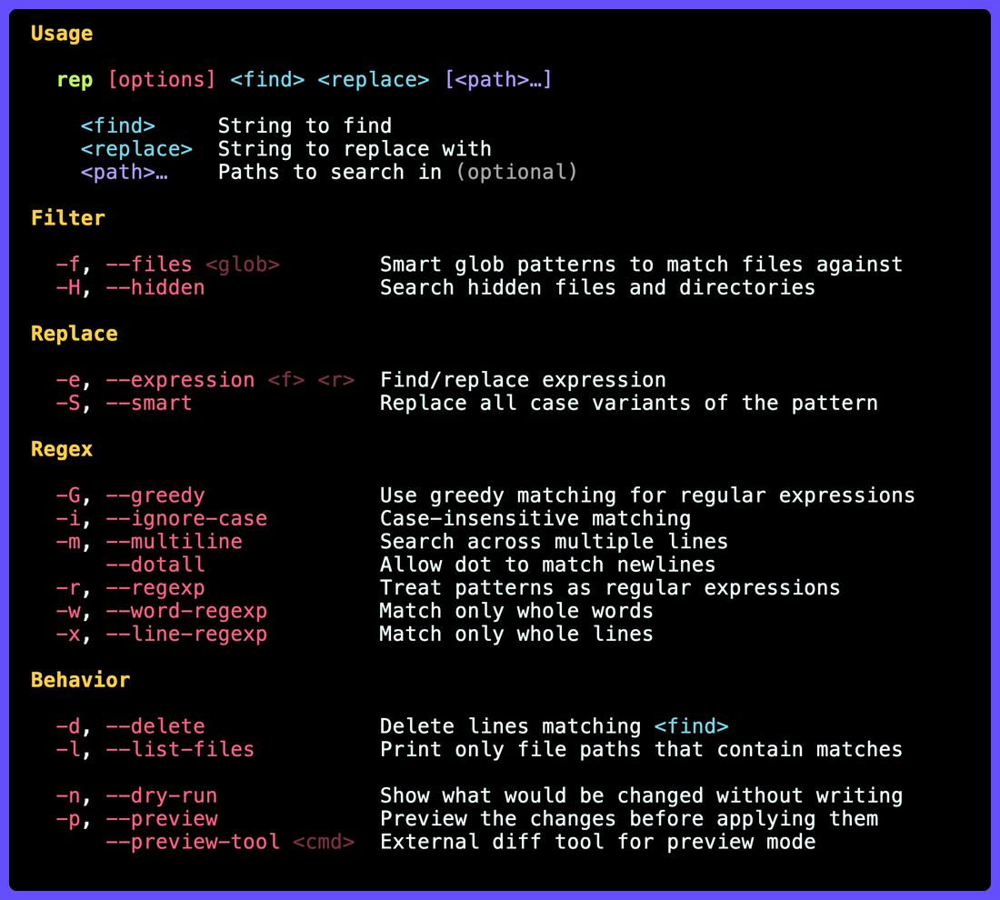

# rep

`rep` is a fast find-and-replace tool, based on [fastmod](https://github.com/facebookincubator/fastmod).

Features plain and regex replacement, smart preserve-case rewrites, interactive preview, line deletion, file listing, dry runs, stdin mode, and multiple `-e/--expression` replacements in one pass.

## Install

```shell
brew install gechr/tap/rep
```

Or with Cargo:

```shell
cargo install --git https://github.com/gechr/rep
```

## Usage



## Examples

```sh
# Replace "1.2.3" with "4.5.6" in all files
rep 1.2.3 4.5.6

# Replace "foo" with "bar" in "*.txt" files
rep -f txt foo bar

# Replace "foo" with "bar" in all (hidden) files
rep --hidden foo bar

# Replace "foo" with "bar" in all (hidden) Dockerfiles
rep -f '=Dockerfile' --hidden foo bar

# Replace "foo" with "bar" in all files and preview changes
rep --preview foo bar

# Replace "1.2.3" and "3.2.1" with "4.5.6" in all files
rep --regexp '[13]\.2\.[13]' 4.5.6

# Swap "foo.bar" with "bar.foo" in all files
rep --regexp '(foo)\.(bar)' '$2.$1'

# Replace "f.oo" and "F.OO" with "bar"
rep --ignore-case 'f.oo' bar

# Smart-replace in all files:
#  "foo_bar" with "hello_world"
#  "FooBar"  with "HelloWorld"
#  "FOO_BAR" with "HELLO_WORLD"
rep --smart foo_bar hello_world

# Read from stdin and replace "foo" with "bar"
echo foo bar | rep foo bar
rep foo bar < foobar.txt

# Apply multiple replacements in one pass
rep -e foo bar -e baz qux src

# Delete every line containing "TODO"
rep -d TODO
```
